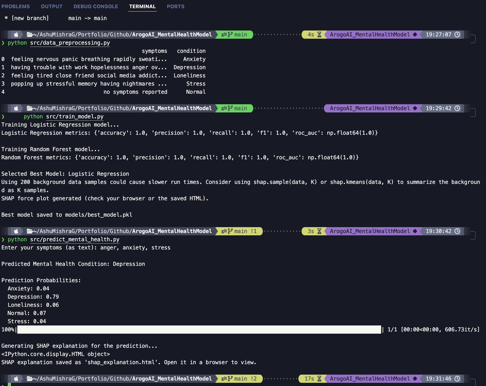
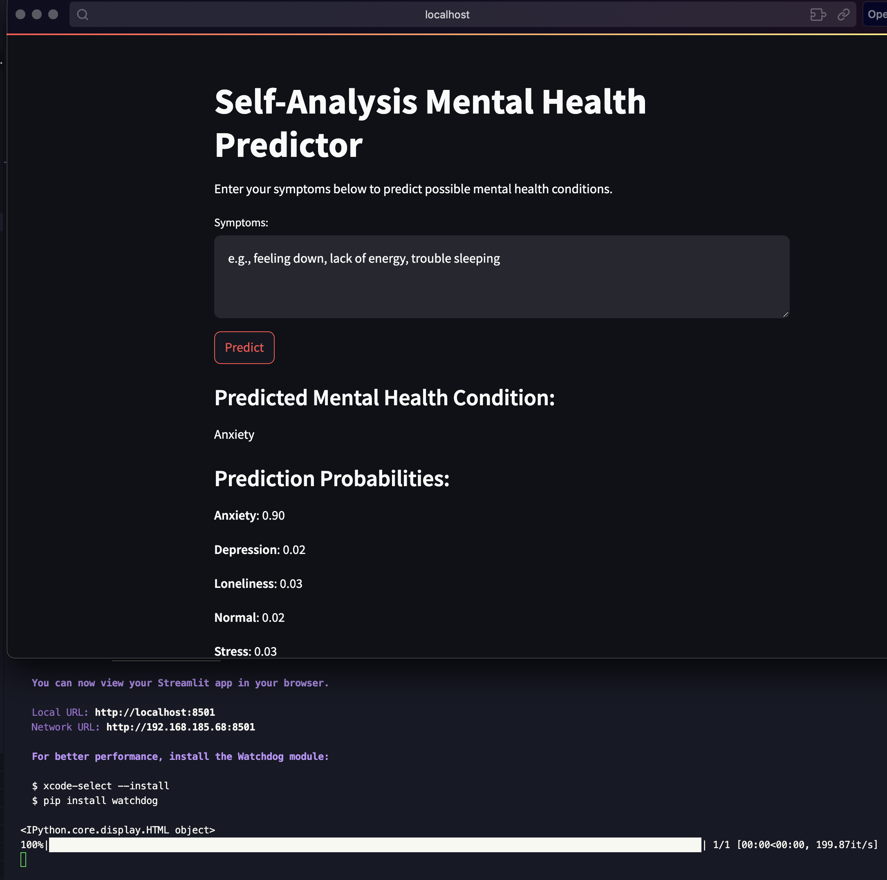

# Arogo AI - Self-Analysis Mental Health Predictor


_Terminal View_


_UI View_


_SHAP View_

Welcome to the Arogo AI project! This project is part of the AI/ML Engineer Intern Assignment and focuses on developing a self-analysis mental health model that predicts possible mental health conditions based on user-provided symptoms. The model emphasizes accuracy, interpretability (using SHAP), and efficiency, and is designed for seamless integration into chatbots or applications.

---

## Table of Contents

-  [Project Overview](#project-overview)
-  [Data Preparation](#data-preparation)
-  [Model Development](#model-development)
-  [Inference and UI](#inference-and-ui)
-  [Project Structure](#project-structure)
-  [Setup Instructions](#setup-instructions)
-  [Usage Instructions](#usage-instructions)
-  [Kaggle Dataset](#kaggle-dataset)
-  [Additional Notes](#additional-notes)

---

## Project Overview

The Self-Analysis Mental Health Predictor leverages machine learning to analyze user-reported symptoms and predict potential mental health conditions. Key components include:

-  **Data Preparation:** Cleaning, preprocessing, feature engineering, and exploratory analysis.
-  **Model Development:** Training & evaluating multiple models (e.g., Logistic Regression and Random Forest) using metrics such as Accuracy, Precision, Recall, F1-score, and ROC-AUC. SHAP is used for model interpretability.
-  **Inference & UI:**
   -  A CLI-based inference script (`predict_mental_health.py`) to generate predictions and produce SHAP explanations saved as interactive HTML.
   -  A basic web UI (`mental_health_ui.py`) built with Streamlit for interactive testing.

---

## Data Preparation

The dataset is curated from publicly available mental health datasets. For this project, we are using the dataset from Kaggle:

-  **Dataset Link:** [Mental Health Symptoms Datasets](https://www.kaggle.com/datasets/rohitzaman/mental-health-symptoms-datasets?resource=download)

Data preprocessing includes:

-  Cleaning and normalization
-  Handling missing values
-  Exploratory Data Analysis (EDA)
-  Feature engineering and selection

---

## Model Development

We trained multiple models for multi-class classification of mental health conditions. The evaluation metrics include:

-  Accuracy
-  Precision
-  Recall
-  F1-score
-  ROC-AUC

The best performing model is selected (saved as `models/best_model.pkl`) and was interpreted using SHAP to provide interactive explanations.

---

## Inference and UI

-  **Command-Line Inference:**  
   Use the `predict_mental_health.py` script to input symptoms via the terminal and obtain predictions along with a SHAP explanation saved as an HTML file.
-  **Web UI:**  
   A basic UI built with Streamlit (`mental_health_ui.py`) allows users to:
   -  Input their symptoms
   -  View the predicted mental health condition and associated probabilities
   -  See an interactive SHAP force plot explanation embedded directly into the UI

---

## Project Structure

## Setup Instructions

1. **Clone the repository**:
   ```bash
   git clone <repository_url>
   cd <repository_directory>
   ```
2. **Create a virtual environment (optional but recommended)**:
   ```bash
   python -m venv env
   source env/bin/activate  # On Windows use `env\Scripts\activate`
   ```
3. **Install Dependencies**:
   ```bash
   pip install -r requirements.txt
   ```
   _Sample `requirements.txt`_:
   ```
   numpy
   pandas
   scikit-learn
   joblib
   shap
   streamlit
   ```

## Running the Project

### 1. Model Training

Run the training script to preprocess data, train models, evaluate them, and save the best model. This step also generates a SHAP explanation for a sample input.

## Data Preparation

By default, the project uses a dummy dataset defined in `src/data_preprocessing.py`. To use your own dataset:

-  Place your CSV file in the project.
-  Modify the `load_data` function in `src/data_preprocessing.py` to load from your CSV.

## Training the Model

Run the training script:

```bash
python src/train_model.py
```

### 2. Inference via Command-Line

Use the inference script to enter symptoms and get a prediction along with a SHAP explanation (saved as `shap_explanation.html`):

```bash
python src/predict_mental_health.py
```

Then, open `shap_explanation.html` in your browser to view the explanation.

### 3. Interactive UI (Streamlit)

Launch the basic UI to interactively input symptoms, view predictions, and see an embedded SHAP explanation.

```bash
streamlit run mental_health_ui.py
```

## Usage Instructions

1. **Command-Line Interface**:

   -  Run the inference script and follow on-screen prompts.
   -  The model outputs the predicted mental health condition and prediction probabilities.
   -  The SHAP explanation is saved as an HTML file.

2. **Web UI**:
   -  Run the Streamlit UI.
   -  Input your symptoms in the text area.
   -  Click the "Predict" button.
   -  View the prediction, probabilities, and an interactive SHAP explanation displayed inline.